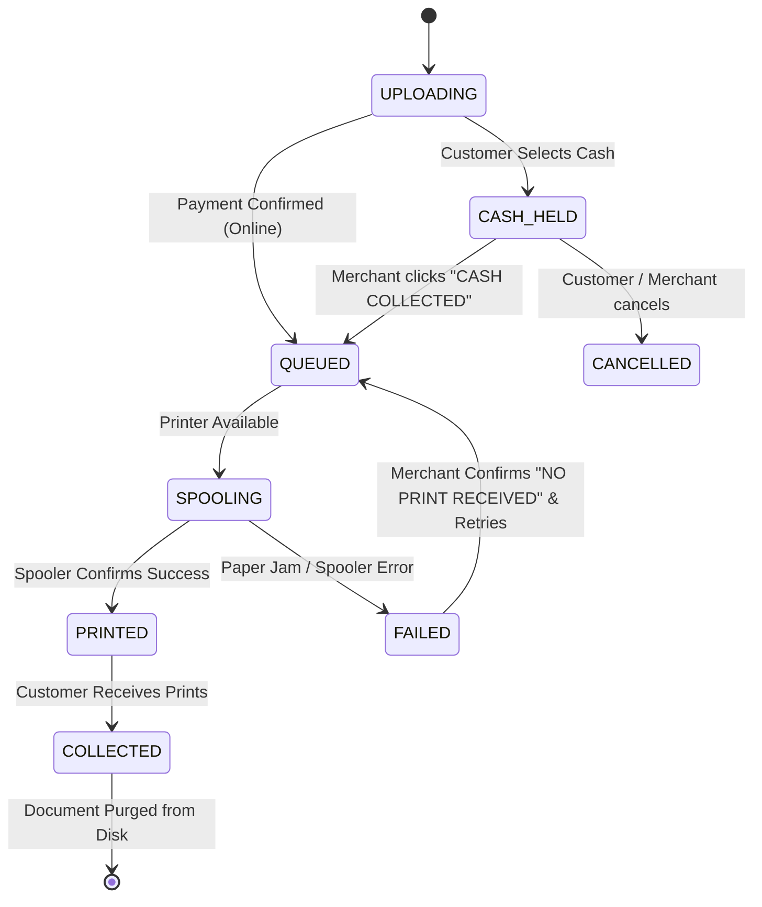

# AutoPrint — Master Architecture Specification

**System**: AutoPrint Production Platform  
**Document**: MASTER_ARCHITECTURE.md  
**Release Target**: Cross-Platform (Windows 7/8/10/11 & Linux CUPS)  

---

## 1. Architectural Philosophy & Invariants

AutoPrint is engineered with three foundational architectural invariants:

1. **Local-First & Offline Resilience**:
   * The application operates completely self-contained. The local SQLite database, print engine, and queue manager never depend on remote cloud servers or internet connectivity.
   * If the internet is disconnected, counter printing, cash payments, and local Wi-Fi uploads continue without interruption.

2. **Unidirectional Layer Separation**:
   $$\text{Presentation Tier (React 19)} \longrightarrow \text{API Gateway & Middlewares} \longrightarrow \text{Domain Services} \longrightarrow \text{Repositories & Hardware Abstraction} \longrightarrow \text{SQLite 3 & OS Spooler}$$
   * Visual components NEVER query the database or OS APIs directly.
   * All database queries run through prepared statements in dedicated repository classes.
   * All hardware interactions run through the `PrinterService` abstraction layer.

3. **Ephemeral Document Lifecycle (Zero Storage Leakage)**:
   * Uploaded files exist on disk ONLY while a job is pending or printing.
   * The instant a merchant marks a job as `COLLECTED`, the file on disk is securely wiped, eliminating privacy risks and disk saturation.
   * Job financial records, metadata, and audit logs remain permanently in SQLite.

---

## 2. Multi-Tier System Blueprint

```mermaid
graph TB
    subgraph Client Ingress Tier
        MobileUser["Customer Mobile Browser (Local Wi-Fi / 4G)"]
        KioskUser["Shop Kiosk Terminal (Touchscreen / Chromium)"]
    end

    subgraph Host Workstation (Windows 7/10/11 / Linux)
        TraySupervisor["AutoPrint.exe Native Host (.NET 4.5.2 Tray Host)"]

        subgraph Presentation Tier
            CustWeb["Customer Web App (:7000 Vite / React 19 / Motion)"]
            MerchWeb["Merchant Desktop (:8000 Vite / React 19 / Motion)"]
        end

        subgraph Service & Control Tier (:5000 Express / TS Engine)
            APIGateway["Express Router & Zod Validation"]
            AuthEngine["Auth & Timing-Safe Security Engine"]
            RateLimiter["Sliding-Window DoS & Brute-Force Limiter"]
            JobEngine["AutoPrint Job Lifecycle Service"]
            PricingEngine["Local Multi-Tier Pricing Service"]
            QRManager["Dynamic LAN & Public QR Code Service"]
            TunnelMgr["PageKite Subprocess Tunnel Manager"]
            PrinterEngine["Hardware Spooler & Printer Manager"]
        end

        subgraph Persistence & Hardware Tier
            SQLiteDB[("SQLite 3 Database (WAL Mode)\nautoprint.db")]
            DocStore["Encrypted/Sanitized Upload Datastore\nProgramData/AutoPrint/datastore"]
            WinSpooler["Windows Print Spooler (winspool.drv / WMI)"]
            CupsSpooler["Linux CUPS Printing Daemon (lp / lpstat)"]
            SumatraCLI["Headless SumatraPDF Win32 Engine"]
            PhysicalPrinters["Physical USB & Network Printers"]
        end
    end

    MobileUser -->|HTTP :7000 via Wi-Fi or PageKite| CustWeb
    KioskUser -->|HTTP http://localhost:7000| CustWeb
    CustWeb -->|Internal Proxy /api| APIGateway
    MerchWeb -->|Authenticated REST API :5000| APIGateway

    TraySupervisor -.->|Spawns & Supervises| APIGateway
    TraySupervisor -.->|Monitors Process Health| APIGateway

    APIGateway --> AuthEngine
    APIGateway --> RateLimiter
    APIGateway --> JobEngine
    APIGateway --> PricingEngine
    APIGateway --> QRManager
    APIGateway --> TunnelMgr
    APIGateway --> PrinterEngine

    JobEngine --> SQLiteDB
    JobEngine --> DocStore
    PrinterEngine --> WinSpooler
    PrinterEngine --> SumatraCLI
    PrinterEngine --> CupsSpooler
    SumatraCLI --> PhysicalPrinters
    CupsSpooler --> PhysicalPrinters
```

---

## 3. Subsystem Breakdown

### 3.1 Supervisor & System Tray Subsystem (`AutoPrint.exe`)
* **Technology**: C# targeting .NET Framework 4.5.2 (compatible with Windows 7 SP1 up to Windows 11).
* **Role**: Starts Node.js backend silently in the background (no black console windows). Creates a system tray icon with a right-click menu:
  * "Open Merchant Dashboard" (launches default browser at `http://localhost:8000`).
  * "Open Customer Kiosk" (launches `http://localhost:7000`).
  * "Restart All Services".
  * "View Live Logs".
  * "Exit AutoPrint".
* **Process Watchdog**: Automatically restarts child processes if they exit unexpectedly.

### 3.2 Application Service Tier (`app/backend`)
* **Technology**: Express, TypeScript, Better-SQLite3, Multer, PDF-Lib.
* **Ports**:
  * `5000`: Internal REST API and static asset host.
  * `7000`: Customer Kiosk Web interface.
  * `8000`: Merchant Desktop management interface.
* **Network Binding**: Binds to `0.0.0.0` so customer phones on the shop's local Wi-Fi router can access port 7000 using the shop's LAN IP address (`http://192.168.x.x:7000`).

### 3.3 Hardware Printing Abstraction Subsystem
* **Abstraction**: `PrinterService` provides a unified interface across Windows and Linux:
  ```typescript
  interface IPrinterManager {
    getAvailablePrinters(): Promise<PrinterDevice[]>;
    getPrinterStatus(printerName: string): Promise<PrinterStatus>;
    printDocument(job: PrintJobRecord, filePath: string, options: PrintOptions): Promise<PrintResult>;
    cancelPrintJob(spoolerJobId: string): Promise<boolean>;
  }
  ```
* **Windows Implementation**: Discovers printers via WMI; dispatches PDF printing silently via SumatraPDF CLI without displaying print dialogues.
* **Linux Implementation**: Discovers printers via `lpstat -p -d`; dispatches jobs via `lp -d <PrinterName> -o fit-to-page <FilePath>`.

---

## 4. State Transition Machine

Every print job progresses through five orthogonal, well-defined states:



---

## 5. Security Architecture & Threat Model

| Threat Scenario | Mitigation in AutoPrint |
|---|---|
| **Brute-Force Verification Code Guessing** | Sliding-window rate limiter restricts `/api/jobs/search/:code` to 10 requests/min per IP. |
| **Command Injection via Printer Names** | Printer names and file paths are parameterized arrays; shell invocation (`cmd.exe /c`) is strictly prohibited. |
| **Path Traversal on Document Uploads** | Filenames are stripped with `path.basename()` and mapped to internal UUID filenames (`AP-DOC-UUID.pdf`). |
| **Customer Document Snooping** | Upload directory permissions restricted; original files permanently deleted upon collection. |
| **Token Stealing via URLs** | Authentication tokens passed in URL query strings are explicitly rejected; strict Bearer headers required. |
