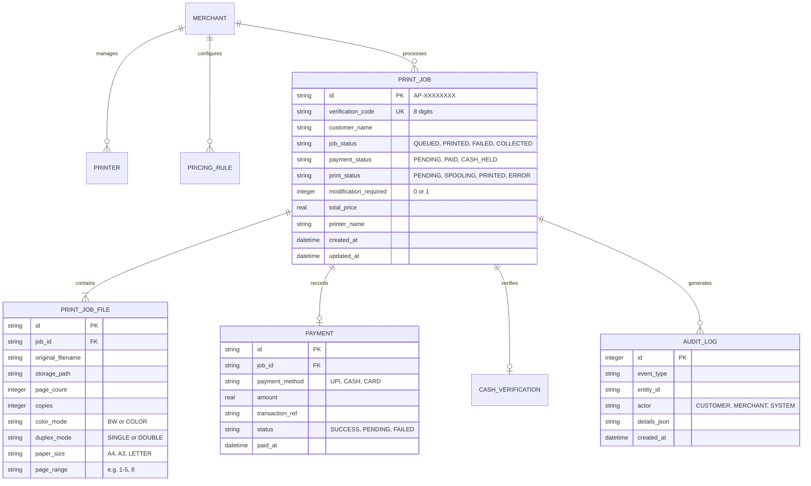

# AutoPrint — Master Technical Specification

**Product**: AutoPrint  
**Version**: 2.0.0  
**Target Runtimes**: Node.js v18-v22 / .NET Framework 4.5.2+ / Python 3.8+ / Modern Browsers  
**Target Operating Systems**: Windows 7 (SP1 64-bit), Windows 8, Windows 10, Windows 11, Linux (Ubuntu/Debian)  

---

## 1. System Architecture & Process Topology

AutoPrint is architected as an offline-first, event-driven multi-process application running locally on the merchant's machine:

```text
┌─────────────────────────────────────────────────────────────────────────┐
│                           AutoPrint.exe                                 │
│                   (.NET 4.5.2 Native System Tray Host)                  │
└────────────────────────────────────┬────────────────────────────────────┘
                                     │ Supervises child processes
         ┌───────────────────────────┴───────────────────────────┐
         ▼                                                       ▼
┌─────────────────────────────────┐             ┌─────────────────────────────────┐
│     Backend Engine (:5000)      │             │  Optional PageKite Subprocess   │
│   Node.js / Express / TypeScript│             │   (Public Reverse Proxy Tunnel) │
│  - REST API & Input Sanitization│             └─────────────────────────────────┘
│  - SQLite 3 (WAL mode)          │
│  - Windows Spooler Dispatch     │
│  - SumatraPDF Silent Engine     │
└────────┬──────────────────────┬─┘
         │                      │
         ▼                      ▼
┌──────────────────┐   ┌──────────────────┐
│  Merchant Web    │   │  Customer Kiosk  │
│ Desktop (:8000)  │   │   Web (:7000)    │
│ React 19 / Vite  │   │ React 19 / Vite  │
└──────────────────┘   └──────────────────┘
```

---

## 2. API Contract & Communication Endpoints

All endpoints use JSON encoding with strict input validation via `zod` and error handling returning `{ ok: boolean, data?: any, error?: string }`.

### 2.1 Customer Kiosk Endpoints
* `POST /api/jobs`: Multipart form upload receiving document files (`file`), customer name, print configuration, and payment intent.
* `GET /api/jobs/:id`: Fetches real-time status of a job (polled by customer status modal).
* `GET /api/config/public`: Returns shop name, currency, paper rates, and LAN/PageKite customer URL.
* `GET /api/config/qr-code`: Returns PNG data URL / SVG of the counter standee Shop QR code.

### 2.2 Merchant Management Endpoints
* `POST /api/auth/login`: Authenticates merchant using username and password; returns session token.
* `POST /api/auth/unlock`: Unlocks the dashboard after 10-minute inactivity timeout.
* `GET /api/jobs`: Returns active and historical print queue items with filtering by status and date.
* `GET /api/jobs/search/:code`: Searches for a job using the 8-digit Collection Code.
* `POST /api/jobs/:id/cash-collected`: Marks a held cash job as paid and triggers instant print spooling.
* `POST /api/jobs/:id/print`: Manually triggers printing or retries a failed print.
* `POST /api/jobs/:id/collected`: Marks physical handover as complete; triggers immediate file deletion.
* `GET /api/jobs/:id/download`: Allows merchant download of uploaded file if customer requested modification.
* `GET /api/printers`: Discovers connected local and network printers with real-time status flags.
* `POST /api/setup`: Executes initial shop setup, saves credentials, and initializes rates.

---

## 3. Database Schema & Data Modeling

Storage is managed by SQLite 3 in Write-Ahead Logging (`WAL`) mode located at `C:\ProgramData\AutoPrint\datastore\backend\database\autoprint.db`.



---

## 4. Hardware & Printing Subsystem

### 4.1 Discovery Engine (`PrinterService.getAvailablePrinters()`)
* **Windows**: Queries WMI (`Get-CimInstance Win32_Printer`) via PowerShell, parsing `Name`, `Default`, `PrinterStatus`, `WorkOffline`, and `PortName`.
* **Linux**: Executes `lpstat -p -d` to parse active CUPS printer queues and default destinations.

### 4.2 Silent Direct Spooling Engine
* **Technology**: Bundled portable SumatraPDF Win32 CLI engine located at `tools/sumatrapdf/SumatraPDF.exe`.
* **Execution Command**:
  ```powershell
  SumatraPDF.exe -print-to "<PrinterName>" -silent -print-settings "<copies>x,<duplex>,fit" "<FilePath>"
  ```
* **Failure & Duplicate Print Protection**:
  * If the spooler returns an error, the job status moves to `FAILED`.
  * The merchant dashboard shows a prominent warning: *"Job may have partially printed. Confirm NO PRINT RECEIVED before retrying."*
  * Retry requires explicit operator confirmation.

---

## 5. Security & Cryptographic Specifications

1. **Authentication**: Argon2id / Scrypt password hashing with unique 16-byte random salts.
2. **Timing Attack Protection**: Token verification uses `crypto.timingSafeEqual` over fixed-length buffers.
3. **Rate Limiting**: Sliding-window in-memory rate limiter on `/api/jobs/search/:code` restricts lookups to 10 requests/minute per IP, blocking automated code guessing.
4. **Command Injection Prevention**: All PowerShell and SumatraPDF invocations use parameterized string arrays passed directly to `child_process.execFile` or `spawn`, completely bypassing the shell command line interpreter.
5. **Sanitized Diagnostic Logging**: All log exporters automatically redact passwords, API keys, tokens, and payment secrets matching regex patterns.
