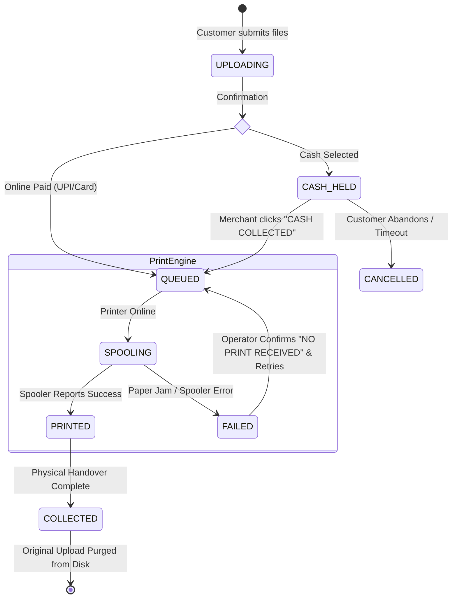
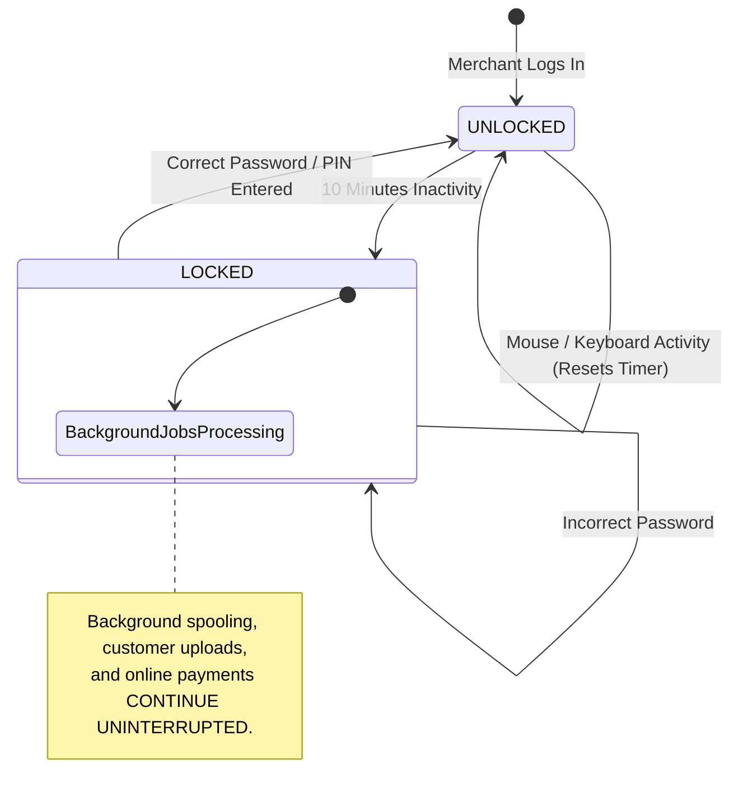

# AutoPrint — Workflows & State Machines

**Document ID**: 02-11  
**Category**: Design  

---

## 1. Job State Lifecycle Machine

AutoPrint uses five orthogonal lifecycle states to prevent ambiguity between financial authorization and physical printing:

---

## 2. Inactivity Lockout State Machine

The Merchant Dashboard protects sensitive sales figures and pricing controls with an automatic inactivity lock:

---

## 3. Modification Required Workflow

When a customer needs physical intervention or formatting help:

1. Customer checks **"MODIFICATION REQUIRED"** on upload.
2. Job is flagged with a blue badge in the merchant queue.
3. Automatic spooling is paused for this job.
4. Merchant clicks **"DOWNLOAD DOCUMENT"** to save the file locally.
5. Merchant edits the file in external software (Word/Excel/Photoshop).
6. Merchant prints using the system print dialog.
7. Merchant marks job as **"COLLECTED"** to finalize accounting.
