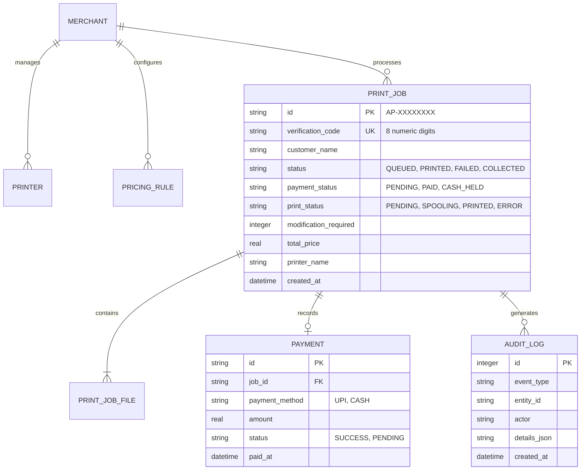
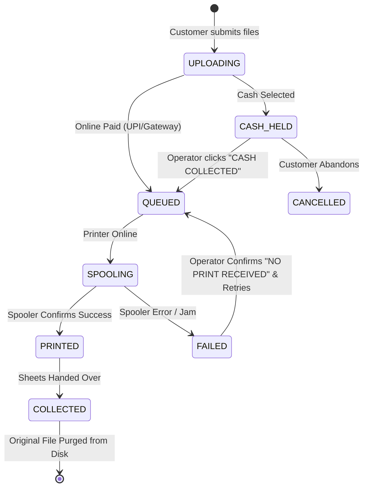

# AutoPrint — SDLC Phase 2: System Architecture & Design Specification

**Document Reference**: SDLC-DOC-02  
**Phase**: 2 — Software Architecture, Subsystem Modeling & Detailed Design  
**Product**: AutoPrint  
**Version**: 2.0.0 (Production Release)  

---

## 1. Architectural Principles & Invariants

AutoPrint is designed around four non-negotiable architectural invariants:

1. **Local-First & Complete Offline Independence**: The entire printing pipeline, rate engine, queue, and database operate in-process on the local machine. The application never requires remote servers to print.
2. **Strict Unidirectional Separation of Concerns**:
   $$\text{Presentation Tier (React 19)} \longrightarrow \text{API Gateway \& Middlewares} \longrightarrow \text{Domain Services} \longrightarrow \text{Repositories / Drivers} \longrightarrow \text{SQLite 3 / OS Spooler}$$
   Visual components NEVER query SQLite, the filesystem, or operating system APIs directly.
3. **Ephemeral Document Lifecycle**: Uploaded documents exist only temporarily in `datastore/uploads/`. Once the merchant marks a job as `COLLECTED`, the file is securely deleted from the disk while keeping accounting metadata in SQLite.
4. **Hardware Driver Decoupling**: All printing operations route through a hardware abstraction interface, separating Windows spooler specifics from core business logic.

---

## 2. Multi-Tier System Topology

```mermaid
graph TB
    subgraph Client Ingress Tier
        MobileUser["Customer Mobile Browser (Local Wi-Fi / 4G)"]
        KioskUser["Shop Kiosk Terminal (Touchscreen / Chromium)"]
    end

    subgraph Host Workstation (Windows 7/8/10/11 / Linux)
        TraySupervisor["AutoPrint.exe Native Host (.NET 4.5.2 Tray Host)"]

        subgraph Presentation Tier
            CustWeb["Customer Web App (:7000 Vite / React 19 / Motion)"]
            MerchWeb["Merchant Desktop (:8000 Vite / React 19 / Motion)"]
        end

        subgraph Service & Control Tier (:5000 Express / TS Engine)
            APIGateway["Express Router & Zod Validation"]
            AuthEngine["Auth & Timing-Safe Security Engine"]
            RateLimiter["Sliding-Window DoS & Brute-Force Limiter"]
            JobEngine["AutoPrint Job Lifecycle Service"]
            PricingEngine["Local Multi-Tier Pricing Service"]
            QRManager["Dynamic LAN & Public QR Code Service"]
            CloudAccess["Hosted Store / LAN Access URL Service"]
            PrinterEngine["Hardware Spooler & Printer Manager"]
        end

        subgraph Persistence & Hardware Tier
            SQLiteDB[("SQLite 3 Database (WAL Mode)\nautoprint.db")]
            DocStore["Sanitized Upload Datastore\nProgramData/AutoPrint/datastore"]
            WinSpooler["Windows Print Spooler (winspool.drv / WMI)"]
            CupsSpooler["Linux CUPS Printing Daemon (lp / lpstat)"]
            SumatraCLI["Headless SumatraPDF Win32 Engine"]
            PhysicalPrinters["Physical USB & Network Printers"]
        end
    end

    MobileUser -->|Hosted store or HTTP :7000 via Wi-Fi| CustWeb
    KioskUser -->|HTTP http://localhost:7000| CustWeb
    CustWeb -->|Internal Proxy /api| APIGateway
    MerchWeb -->|Authenticated REST API :5000| APIGateway

    TraySupervisor -.->|Spawns & Supervises| APIGateway
    TraySupervisor -.->|Monitors Process Health| APIGateway

    APIGateway --> AuthEngine
    APIGateway --> RateLimiter
    APIGateway --> JobEngine
    APIGateway --> PricingEngine
    APIGateway --> QRManager
    APIGateway --> CloudAccess
    APIGateway --> PrinterEngine

    JobEngine --> SQLiteDB
    JobEngine --> DocStore
    PrinterEngine --> WinSpooler
    PrinterEngine --> SumatraCLI
    PrinterEngine --> CupsSpooler
    SumatraCLI --> PhysicalPrinters
    CupsSpooler --> PhysicalPrinters
```

---

## 3. Subsystem Specifications

### 3.1 Supervisor & System Tray Subsystem (`AutoPrint.exe`)
* **Technology**: C# targeting .NET Framework 4.5.2 (WinForms).
* **Rationale**: Out-of-the-box compatibility across Windows 7 SP1, 8, 10, and 11 without requiring modern .NET runtimes.
* **Responsibilities**:
  * Silently spawns the Node.js backend (`server.js`) without flashing console windows.
  * System Tray icon with controls: Open Merchant Dashboard, Open Customer Kiosk, Restart Services, View Logs, Exit.
  * Watchdog timer restarting child processes if an unexpected crash occurs.

### 3.2 Backend Service Engine (`app/backend`)
* **Technology**: Node.js, Express, TypeScript, Better-SQLite3, PDF-Lib.
* **Ports**: `5000` (REST API & static host), `7000` (Customer Kiosk), `8000` (Merchant Dashboard).
* **Network Binding**: Binds to `0.0.0.0` so mobile phones on the shop's local Wi-Fi router can reach the kiosk at `http://192.168.x.x:7000`.

### 3.3 Hardware Printing Subsystem
* **Discovery Interface**:
  * **Windows**: Queries WMI (`Get-CimInstance Win32_Printer`) via PowerShell, parsing `Name`, `Default`, `PrinterStatus`, `WorkOffline`, and `PortName`.
  * **Linux**: Executes `lpstat -p -d` to inspect CUPS printer queues.
* **Silent Direct Spooling**:
  * Uses bundled Win32 SumatraPDF CLI (`tools/sumatrapdf/SumatraPDF.exe`).
  * Command:
    ```powershell
    SumatraPDF.exe -print-to "<PrinterName>" -silent -print-settings "<copies>x,<duplex>,fit" "<filePath>"
    ```
  * Completely bypasses interactive GUI dialogs for instant, silent paper output.

---

## 4. Database Architecture & Schema Design

SQLite 3 in Write-Ahead Logging (`WAL`) mode located at `C:\ProgramData\AutoPrint\datastore\backend\database\autoprint.db`.



### Key DDL Tables
* **`print_jobs`**: Core queue records, verification codes, pricing, and normalized settings JSON.
* **`merchants` & `merchant_credentials`**: Salted Argon2id/Scrypt password hashes and emergency recovery keys.
* **`pricing_rules`**: Per-page rates for A4 B&W, A4 Color, A3, duplex discounts, and custom services.
* **`audit_logs`**: Permanent tamper-evident compliance log of all financial and administrative actions.

---

## 5. State Transition Machines

### 5.1 Job Lifecycle State Machine


### 5.2 Inactivity Lockout State Machine
* **Timeout**: 10 minutes of zero mouse/keyboard activity locks the Merchant Dashboard.
* **Background Continuity**: Customer uploads, online payments, and active spooling continue uninterrupted while the UI is locked.
* **Unlock**: Operator enters merchant password or emergency recovery code.

---

## 6. UI/UX Motion Primitives Design System

Built on Motion (Framer Motion v12) + Tailwind CSS v4 in React 19:
* **`AnimatedGroup`**: Staggers metric cards, queue rows, and configuration tiles using spring physics (`stiffness: 400`, `damping: 30`).
* **`TextEffect`**: Staggers headline words/characters for welcoming kiosk onboarding.
* **`InView`**: Viewport intersection-based reveal animations.
* **`Disclosure`**: Accessible accordion for complex printer and pricing settings.
* **Reduced Motion Compliance**: All components implement `useReducedMotion()`. When `prefers-reduced-motion: reduce` is detected, transform offsets and stagger delays are completely eliminated, falling back to instant opacity transitions.
