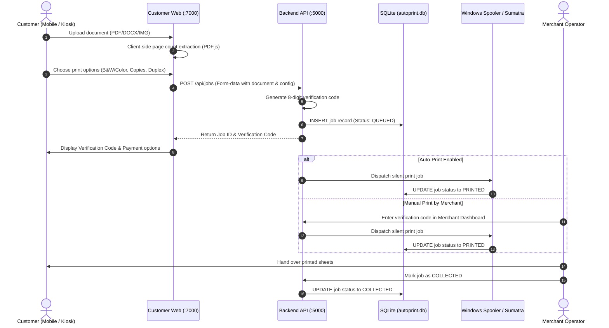

# QRPrint System Architecture Specification

**Product**: QRPrint — Offline Windows Kiosk & Print Shop Management System  
**Version**: 2.0.0 (Production Release)  
**Supported OS**: Windows 7 SP1 (64-bit), Windows 10, Windows 11  
**Architecture Model**: Pure Local / Offline-First Multi-Tier Architecture  

---

## 1. High-Level Architecture Overview

QRPrint operates as a self-contained local appliance on the merchant's Windows workstation. It has zero dependencies on internet connectivity, remote databases, or cloud authentication servers.

```mermaid
flowchart TD
    subgraph Customer Tier (Local Wi-Fi / Kiosk)
        MobileBrowser["Customer Mobile Browser (Local Wi-Fi)"]
        KioskBrowser["Counter Touch Kiosk (Localhost)"]
    end

    subgraph Merchant Station (Windows PC)
        Launcher["AutoPrint.exe (.NET 4.5.2 Native Launcher)"]
        
        subgraph Web Presentation Tier
            CustWeb["Customer Web App (:7000 Vite / React 19)"]
            MerchWeb["Merchant Desktop (:8000 Vite / React 19)"]
        end

        subgraph Application Service Tier (:5000 Express / TS)
            APIService["REST API Gateway & Auth Middleware"]
            JobService["AutoPrint Job Service"]
            PrinterService["Printer & Spooler Service"]
            QRService["QR Code & Network Service"]
            RateLimiter["Sliding-Window Rate Limiter"]
        end

        subgraph Persistence & Hardware Tier
            SQLiteDB[("SQLite 3 Database (WAL Mode)\nautoprint.db")]
            DocStore["Document Datastore\nC:\\ProgramData\\AutoPrint\\datastore"]
            WinSpooler["Windows Print Spooler (winspool.drv)"]
            Sumatra["SumatraPDF CLI Engine (Silent Spooling)"]
            Printers["Physical USB / Network Printers"]
        end
    end

    MobileBrowser -->|HTTP on Local LAN :7000| CustWeb
    KioskBrowser -->|HTTP http://localhost:7000| CustWeb
    CustWeb -->|Proxy /api calls to :5000| APIService
    MerchWeb -->|Authenticated REST API :5000| APIService

    Launcher -.->|Starts & Monitors Processes| APIService
    Launcher -.->|System Tray Icon & Control| Launcher

    APIService --> RateLimiter
    APIService --> JobService
    APIService --> PrinterService
    APIService --> QRService

    JobService --> SQLiteDB
    JobService --> DocStore
    PrinterService --> WinSpooler
    PrinterService --> Sumatra
    Sumatra --> Printers
```

---

## 2. Layer Responsibility Boundaries

To maintain long-term reliability and testability, QRPrint enforces strict unidirectional boundaries:

$$\text{Presentation (UI)} \longrightarrow \text{Application Service} \longrightarrow \text{Repository / Printer Service} \longrightarrow \text{SQLite / Windows Spooler}$$

### Boundary Invariants:
1. **No UI to Database Directly**: Frontend React applications never access SQLite or files directly. All operations pass through structured REST APIs with input validation via Zod.
2. **No UI to Low-Level OS APIs**: Frontend components never invoke PowerShell or Windows printing APIs directly; all hardware interactions are abstracted by `PrinterService`.
3. **Strict Business Logic Isolation**: Pricing logic, verification code generation, and state transitions reside strictly in Application Services (`autoprintService.ts`, `pricingService.ts`), not in database repositories or UI controllers.
4. **Data Access via Repositories**: Database SQL queries are encapsulated inside dedicated repository classes (`autoprintRepository.ts`, `setupRepository.ts`, etc.) using prepared statements.

---

## 3. Core Subsystems

### 3.1 Native Launcher Subsystem (`AutoPrint.exe`)
- **Technology**: C# targeting .NET Framework 4.5.2 for guaranteed compatibility across Windows 7 SP1, Windows 10, and Windows 11.
- **Responsibilities**:
  - Checks and prepares system prerequisites (Node.js runtime, SumatraPDF).
  - Spawns and supervises backend process silently without popping terminal windows.
  - Sits in the Windows System Tray with menu controls: Open Merchant Dashboard, Open Customer Kiosk, Restart Services, View Logs, and Exit.
  - Handles graceful shutdown of child processes on exit.

### 3.2 Backend Service Engine (`app/backend`)
- **Technology**: Node.js, Express, TypeScript, Better-SQLite3, PDF-Lib.
- **Port**: `5000` (Local loopback and LAN binding).
- **Responsibilities**:
  - Ingress document uploads (multipart/form-data with size limits and MIME checking).
  - Generates secure, collision-free 8-digit verification codes for job claim and pickup.
  - Maintains SQLite database schema with automatic schema migration on startup.
  - Serves compiled static frontend production builds from disk.

### 3.3 Hardware & Windows Spooler Subsystem (`PrinterService`)
- **Hardware Integration**:
  - **Printer Discovery**: Queries Windows Management Instrumentation (WMI) via PowerShell (`Get-CimInstance Win32_Printer`) to detect USB, network, and virtual printers with status flags.
  - **Spooler Queue Management**: Detects printer offline, paper out, door open, or job paused states.
  - **Silent Document Dispatch**: Executes SumatraPDF in headless print mode (`-print-to "PrinterName" -silent -print-settings "duplex,fit"`) ensuring zero user dialogue popups.

### 3.4 Local Networking & QR Subsystem
- **Auto-Discovery**: Dynamically inspects active network adapters using `os.networkInterfaces()` to detect the shop's local IPv4 address (`192.168.x.x` or `10.x.x.x`).
- **Counter Standee QR Code**: Generates a high-contrast QR code pointing to `http://<LAN_IP>:7000`. Customers scan the QR code on the shop counter to open the upload kiosk immediately on their mobile browsers without installing any mobile app.

---

## 4. End-to-End Workflow & Data Flow

### 4.1 Document Ingress to Print Dispatch



---

## 5. Offline Operation Guarantee

QRPrint adheres strictly to the **Offline Product Standard**:
1. **Zero External Network Dependencies**: All core printing, billing, QR generation, and database operations execute locally. If the WAN cable is unplugged, QRPrint operates uninterrupted.
2. **Local LAN Capability**: Customers on the shop's local Wi-Fi connect directly to the merchant PC via LAN IPv4.
3. **Local Persistent Storage**: All transactions, paper settings, job histories, and support diagnostics are stored in `C:\ProgramData\AutoPrint\datastore\backend\database\autoprint.db`.
4. **Zero Telemetry / Online Activation**: No activation servers, no tracking beacons, no external CDNs (all font assets and scripts are locally bundled).
